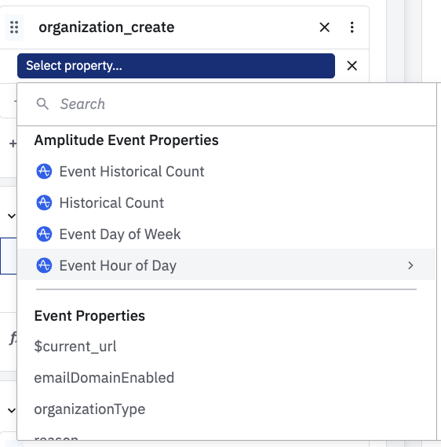

# Amplitude concepts

How it works

Amplitude relies on the implementation of tracking code in our product to work:

By recording users action along with some context (user properties, organization properties, space properties...or device properties) we should have enough context to provide insights and help the product to grow.

## API call type

We are gonna deep dive into the different information we record.

<details>

<summary>Track</summary>

When a user performs an action, we want to record it using a `track` call. Most of the time, we are gonna push the userId, the event name and potentially some event properties

```javascript

{
   // event name
   "event_type":"organization_create",
   
   //event properties
   "event_properties":{
      "reason":"sidebar_menu",
      "useCase":"productDocs",
      "organizationType":"business",
      "emailDomainEnabled":false,
      //screen context
      "screenDomain":"app.gitbook-staging.com",
      "screenPath":"/welcome/o/business",
      "screenPageTitle":"Welcome - GitBook",
      "screenSite":"app",
      "screenURL":"https://app.gitbook-staging.com/welcome/o/business#sidebar_menu"
   },
   
   // user identifier
   "device_id":"46105845-1352-4060-9de8-5a3637bac66bR",
   "user_id":"9rXuKPepJ7beWBpJx6XSm1lMSPv1",
   
   // group identifier
   "groups":{
      "orgId":"xjoQuwb0ANvrSCpC4cYh"
   },
   
   // amplitude sdk
   "timestamp":1708502036569,
   "event_id":893,
   "session_id":1708501883462,
   "version_name":"10.9.608",
   "platform":"Web",
   "os_name":"Chrome",
   "os_version":"121",
   "device_model":"Mac",
   "language":"en-GB",
   "library":{
      "name":"amplitude-js",
      "version":"8.5.0"
   },
   "sequence_number":1349,
   "user_agent":"Mozilla/5.0 (Macintosh; Intel Mac OS X 10_15_7) AppleWebKit/537.36 (KHTML, like Gecko) Chrome/121.0.0.0 Safari/537.36"
}
```

</details>

<details>

<summary>Identify</summary>

To provide more context, we want to keep track of user properties. For instance, some user properties will remain the same - the date of sign-up - but some could change over time: `userPrivateSpaces`.&#x20;

To keep track of the user information, we will send multiple user identify to always have an up-to-date state.

```javascript
// Org identify on creation
{
  "context": {
    "library": {
      "name": "@segment/analytics-node",
      "version": "1.1.4"
    }
  },
  "groupId": "fdsqaujDCRyqVHYxRMIK",
  "integrations": {},
  "messageId": "node-next-1708501933516-5e09d164-6745-41c1-be53-26685830bb9a",
  "originalTimestamp": "2024-02-21T07:52:13.516Z",
  "receivedAt": "2024-02-21T07:52:13.687Z",
  "sentAt": "2024-02-21T07:52:13.528Z",
  "timestamp": "2024-02-21T07:52:13.675Z",
  "traits": {
    "name": "Amplitude Org",
    "organizationBillingCustomerId": "cus_PbNLFm4V40Q4JW",
    "organizationBillingCycle": "monthly",
    "organizationBillingInterval": "monthly",
    "organizationBillingProduct": "free",
    "organizationBillingStatus": "active",
    "organizationCollections": 0,
    "organizationCreateDate": "2024-02-21",
    "organizationCreateMonth": "2024-02-01",
    "organizationCreateWeek": "2024-02-19",
    "organizationEmailDomains": [],
    "organizationFeaturesSet": "free",
    "organizationGuests": 0,
    "organizationHasAI": false,
    "organizationIntegrationsInstalled": [],
    "organizationKey": "fdsqaujDCRyqVHYxRMIK",
    "organizationMembers": 1,
    "organizationName": "Amplitude Org",
    "organizationPrivateCollections": 0,
    "organizationPrivateSpaces": 1,
    "organizationPublicCollections": 0,
    "organizationPublicSpaces": 0,
    "organizationSAMLProviders": [],
    "organizationSnippetsTotal": 0,
    "organizationSnippetsUser": 0,
    "organizationSpaces": 1,
    "organizationTeams": 0,
    "organizationTestingVariant": 0,
    "organizationType": "business",
    "organizationUseCase": "productDocs",
    "plan": "free"
  },
  "type": "group",
  "userId": "9rXuKPepJ7beWBpJx6XSm1lMSPv1",
  "writeKey": "REDACTED"
}
```

</details>

<details>

<summary>Screen or Page</summary>

Other platforms - ie: Segment or Google Analytics - tend to split user events by having a dedicated API call for action/event vs viewing a page/screen.&#x20;

Amplitude doesn't really distinguish the two and we leverage the event name to describe the type of actions being performed.&#x20;

ie: viewing a page will generate an event prefixed with `view_`&#x20;

</details>

## SDK enrichments

When sending an event, Amplitude SDK enriches it by adding some context that could be leveraged in the UI later:

* Device and OS information
* Location (using IP)
* The version of the app
* User attribution (parsing UTM from the URL)

## Properties

There are a bunch of properties when you are gonna hit `Select property...` : Suggested properties, Amplitude Event Properties, Event Properties, User Properties, Amplitude User properties, Derived Properties, Channel Classifier, Space Properties, Org properties, Collection properties...

<figure><figcaption><p>Wide list of properties</p></figcaption></figure>

* **Suggested properties**: auto-generated section by Amplitude based on chart usage. Could be a mix of different properties types, it aims to surface most used ones.
* **Amplitude Event Properties:** auto-generated properties by Amplitude to filter events
* **Event Properties:** properties we push along with the event to give more context
* User Properties: properties attached to the user performing the action. Values at the time of the event.
* **Amplitude User Properties:** auto-generated user properties from Amplitude SDK
* **Derived Properties:** calculated properties we build on top of the current one. Some pretty useful such as `account_day_since_signup` which represents the number of days between the user sign-up and current event.
* **Channel Classifier:** attribution model built on top of UTMs value to classify sign-ups based on their user acquisition channel
* **Group properties:** Space, Org...all groups properties recorded at the time of the event (spaceXXX, organizationXXX...)

### Event properties

Defining the name of the event is the first step, but most events also have some properties to give more context.

For instance, while creating an organization, we ask for the Use Case. We then track an event called `organization_create` having an event property called `useCase` with the selected value.



<figure><figcaption></figcaption></figure>




```json
var event = "organization_create";
var eventProperties = {
    "useCase": "knowledgeBase",
    ....
    // other properties
};
amplitude.getInstance().logEvent(event, eventProperties);
```




<figure><figcaption></figcaption></figure>



### Users properties

One key property embed in a track call is the `userId`. It allows Amplitude to enrich the event with all user's information stored on Amplitude side thanks to the `identify` call.


### Group properties

As a B2B platform, we want to analyze product activity at the user level, but also at the organization level.&#x20;

Amplitude has a feature called Group (or Account) where we can provide more context in the API call such as the organization ID (orgId) attached to the user actions.

ie: when a user creates an organization, the even `organization_create` is sent with the `userId` and the `orgId`.

We currently track 5 groups: space (spaceId), change request (changeRequest), collection, page and organization (orgId).

In any chart, we can pickup which level of aggregation we want to use.

.png>)



When you move to a group, make sure the event you pick up is tracked at the group level. Otherwise, your chart will be empty


To learn more about the list of user properties and group properties:


[user-and-group-properties.md](../amplitude-at-gitbook/user-and-group-properties.md)


## Cohort

Cohort is a powerful way to select a group of users based on multiple criteria. We can apply multiple AND/OR condition with time windows.

It's mainly useful when we want to reuse multiple time a bunch of filter and save time.

Usual workflow: [create a cohort](https://analytics.amplitude.com/gitbook-com/cohort/new) => save it => create a chart => reference the cohort on the right-hand side

.png>)

We can create cohort of users...but also cohort of change request.

ie: I want to deep dive on [change request having different creator or merger:](https://analytics.amplitude.com/gitbook-com/cohort/4u91e6z)

<figure><figcaption><p>Condition applied</p></figcaption></figure>


Most of the time, we don't have to create a dedicated cohort but we can apply condition right in the UI



When saving a cohort, please don't tick "discoverability" unless you think the cohort is highly valuable.&#x20;

If you do want to share, please follow the naming convention: `[MainTopic] - Description - TimeFrame`

.png>)

