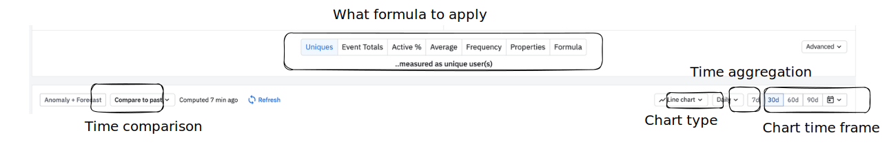

# Chart types

## List

Please find below the list of all chart type.


99% of the time, **Segmentation** and **Funnel** will be the ones to use


.png>)

## Segmentation

The one to master!


Official documentation


### UI

### Formula

Uniques

Will perform a count distinct of id for each point on the chart.

If the analysis is set to use `Users` as an aggregation level, then it will perform unique count of `userId`.

We can switch to `orgId` so it will count the unique number of `organization`.

Totals

Regardless of the type of aggregation selected, it will display the total number of events received.

Note: if a group is selected -such as organization - and we count the total of edits, edits happening outside of an organization will be missing.&#x20;

Formula

You can also go wild and select formula that allows you to do more advanced calculations.

You can then refer to an event using the letter (A, B ...) or reference a group of filter using number (1, 2...)...or reference both using A1, B1...

Learn more here: [https://help.amplitude.com/hc/en-us/articles/115001163231](https://help.amplitude.com/hc/en-us/articles/115001163231)

### Filters

This panel helps you to scope the analysis to a subset of users. It's very powerful as you can also apply rolling count with offset.

Also, filters applied at the cohort level will apply at the event level.

Please look at the following chart:


Chart example


**Explanation**

In the cohort 1, the filter will apply on `auth_sign_up` while in the cohort 2, the filter applies on all the event performed on the day of `auth_sign_up`. So if the user performed once during this sign-up day an event with `lead_company_employees_range` set, then user will be selected in the cohort.

As `lead_company_employees_range` is **not** set at the user level on `auth_sign_up` but few seconds later - API call to Clearbit Enrichment - the cohort 1 will be mainly empty and **incorrect**.

So cohort 1 **doesn't** work.

<figure><figcaption></figcaption></figure>

## Funnel

This chart allows you to analyze a series of steps a user takes within a period of time.


Official doc


### How to display the result

There are 3 **main** ways to display a result

Conversion

The easiest way to present a funnel by looking at each steps conversions

Conversion Over Time

Focus on one step - by default the overall funnel - and display the conversion over time.

Funnel tends to show 1 value while most of the time changes could happen over time. It's always useful as a sanity check to display the conversion of a funnel over time to see how it evolves.

Time to Convert

When there is a completion between 2 steps, it's usually interesting to look at how long it takes on average to perform it.

While Amplitude always display a default settings, we recommend to play with the different parameter to maximize the insight.

ie:

.png>)


**Tips**: you can create a cohort based on completion (or none completion) of a given steps to then leverage it in a chart:

.png>)

