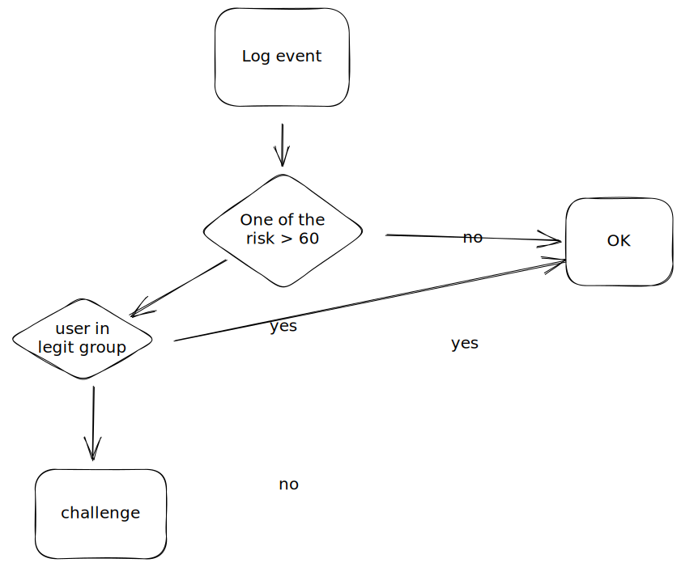

# Castle.io

## Introduction

Castle.io is a service to run product fraud detection using our users activities

## Reference

* [Integrate Castle.io](https://docs.castle.io/docs/a-full-integration)
* [Risk Score explanation](https://docs.castle.io/docs/risk-scoring)
* [Export data from Castle.io](https://docs.castle.io/docs/exporting-data-from-castle)
* [How policies work](https://docs.castle.io/docs/creating-a-policy)
* [Event recognized](https://docs.castle.io/docs/events)
* [Our current policies](https://dashboard.castle.io/policies/list)
* [Our current use of Castle.io](https://github.com/GitbookIO/gitbook-x/blob/4f7c5bf3462782251f9894afb83b8e9c5420fd69/packages/app-cloud-functions/src/api/security/risk.ts#L40)

## Current implementation

Currently, we track all events as **custom** activities and only use Castle.io to block invitation actions ([here](https://github.com/GitbookIO/gitbook-x/blob/42de5270a48edffd4d2e0ba571a6e8f389a46453/packages/app-cloud-functions/src/api/operations/organizations/invites/inviteUsersToOrganization.ts#L85)): [invitation API call](https://github.com/GitbookIO/gitbook-x/blob/42de5270a48edffd4d2e0ba571a6e8f389a46453/packages/app-cloud-functions/src/api/operations/organizations/invites/inviteUsersToOrganization.ts#L85) => we [track](https://github.com/GitbookIO/gitbook-x/blob/4f7c5bf3462782251f9894afb83b8e9c5420fd69/packages/app-cloud-functions/src/api/security/risk.ts#L40) the action in Castle.io as custom event => we get the policy result (`result.policy.action`) based on the policies defined for this action ([here](https://dashboard.castle.io/policies/list)).

On the analytics side, we record the risk score once when sign-in up. We record one of the 3 scores which is `account_abuse` score:

> Note that the `risk` field has been replaced by the `scores.account_abuse` field. These two values will always be identical, and it's recommended that you leverage the latter.

## Limitation

* we don't check risk score on key user lifecycle event: signing, login or logout...or even on signing attempt
* we only record `account_abuse` risk score in the analytics **once** (registration)
* we don't have any `challenge` flow where we could add another layer of security for medium risk score
* we only leverage Castle.io risk score on invitation, but we could introduce it for other key actions such as publishing to the web (everything except `private` visibility)

## Proposal

* **Castle.io tracking**:&#x20;
  * track and implement policies for key user actions in Castle.io such as `$registration` and `$login`, ideally on `attempted` and not `succeeded`
  * track and implement policies for publish (custom policies)
* **Amplitude tracking:** keep tracking in the product cause it's the only way to have it in Amplitude (other solutions will be BigQuery only) but:
  * track `userRiskScoreAccountAbuse`, `userRiskScoreAccountTakeOver` and `userRiskScoreBot` as different user properties
  * track the entire JSON object in `account_verified` by introducing new event properties riskScores, riskSignals and riskPolicy on **every** Casltle.io check

```javascript
{
  "risk": 0.67,
  "scores": {
    "account_abuse": {
        "score": 0.67
    },
    "account_takeover": {
        "score": 0.77
    },
    "bot": {
        "score": 0.34
    }
  },
  "signals": {
    "new_device": {},
    "new_country": {},
    "proxy_ip": {},
    "impossible_travel": {},
    "multiple_accounts_per_device": {},
  },
  "policy": {
    "action": "challenge",
    "name": "Trigger MFA on suspicious logins",
    "id": "e14c5a8d-c682-4a22-bbca-04fa6b98ad0c",
    "revision_id": "b5cf794e-88c0-426e-8276-037ba1e7ceca"
  },
  // The response from the Risk API includes an additional device object,
  // which is a reference to the user's current device, and which can be
  // used in the Castle feedback APIs. This object is not included in the 
  // response from the Filter API
  "device": {
    "token": "eyJhbGciOiJIUzI1NiJ9.eyJ0b2tlbiI6IlQyQ"
  }
}
```

* Challenge workflow: introduce a `challenge` workflow for 60-80 risk score

## Example of spammy users

* [https://app.gitbook.com/admin/u/Q4V7aTQlcCMDJAsf9HejTFmrYYv2](https://app.gitbook.com/admin/u/Q4V7aTQlcCMDJAsf9HejTFmrYYv2)
* [https://app.gitbook.com/admin/u/KFkDCI4N5ghzqbDEm0T88V9K0nf2](https://app.gitbook.com/admin/u/KFkDCI4N5ghzqbDEm0T88V9K0nf2)
* [https://dashboard.castle.io/v2/users/6eeq3EDXq7aIditVixts58q4dS63](https://dashboard.castle.io/v2/users/6eeq3EDXq7aIditVixts58q4dS63)


## Flow

### Sign-up


### Key events



### Other policies

For key events or specific behaviors, we can define bespoke policies that could **automatically** put the user in a challenge mode or in a block mode.&#x20;

* Multiple countries
* More than X organization created
* More than X invitations
* More than X spaces created

### TBD

* [ ] Which key events to implements in Castle.io were we always check if there is any challenge or block policies
* [ ] Which policies to implement?
* [ ] How to handle manual list (could be domain) curated by the Support team
* [ ] Which actions taken per score (bot, spam, ...) as currently we only leverage one score
* [ ] What is:
  * [ ] challenged flow
  * [ ] blocked flow
* [ ] How to track it so we can report and adapt our policies
  * [ ] Event: we should track an event every time we have a challenge or block policy with all the information returned (policy, signals and risk)
  * [ ] Identify: we should send a user identify every time we check Castle with the 3 values

### Question to Castle.io

* [ ] Is there any difference between tracking registration as a custom event vs $registration Castle.io bespoke event?
  * [ ] Only sign-up/in is important cause it's used to train some detection models
* [ ] What is a good range for a challenge flow? for block flow? On any of the 3 scores?
  * [ ] \>90 is pretty solid it could be handled
  * [ ] \>60 is concerning and could enter a challenged flow


