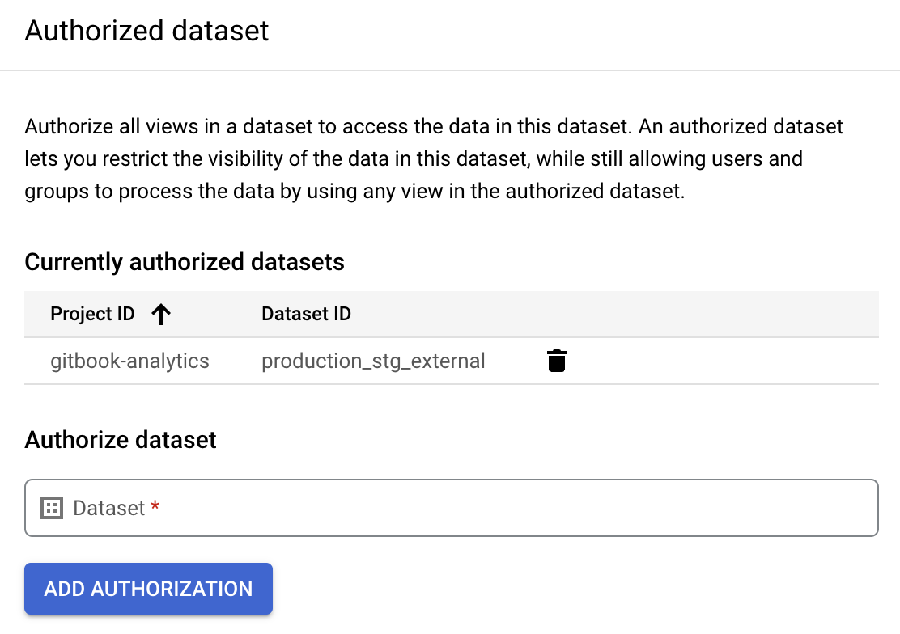

# 🔐 Security

## BigQuery

We have 3 level of access in BigQuery:

* BigQuery admin at the GCP account: only: only Marcus and [Rémi Gonnu](https://app.gitbook.com/u/k78HeV171BTeNuwBVhZhs24cN1g1 "mention")
* Data Analyst group in GCP with a dedicated set of access as described [here](https://github.com/GitbookIO/data-dbt/blob/master/models/temporary/permissions/permissions\_data\_analyst.sql)
* Data Reader group in GCP with a dedicated set of access ad described [here](https://github.com/GitbookIO/data-dbt/blob/master/models/temporary/permissions/permissions\_data\_reader.sql)

## Authorised Dataset

As we don't give direct access to raw data and as we heavily leverage views in staging, we need to give the user access to the underlying data otherwise, we end up with permissions denied:

We leverage [Authorised Dataset](https://cloud.google.com/bigquery/docs/authorized-datasets) feature from BigQuery to do so:

<figure><figcaption></figcaption></figure>
